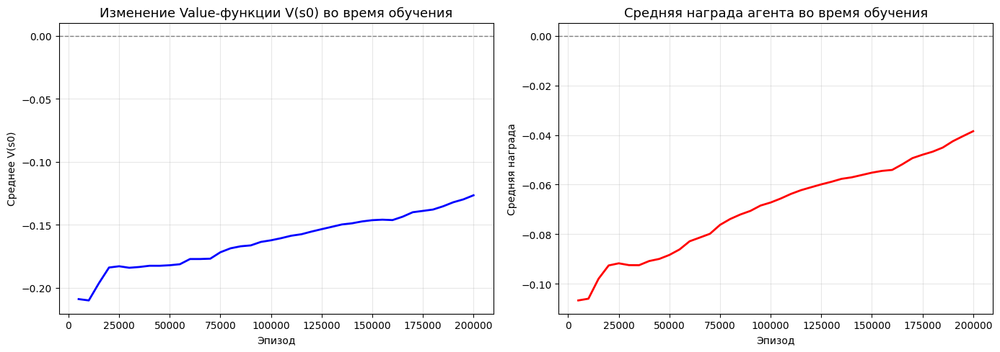
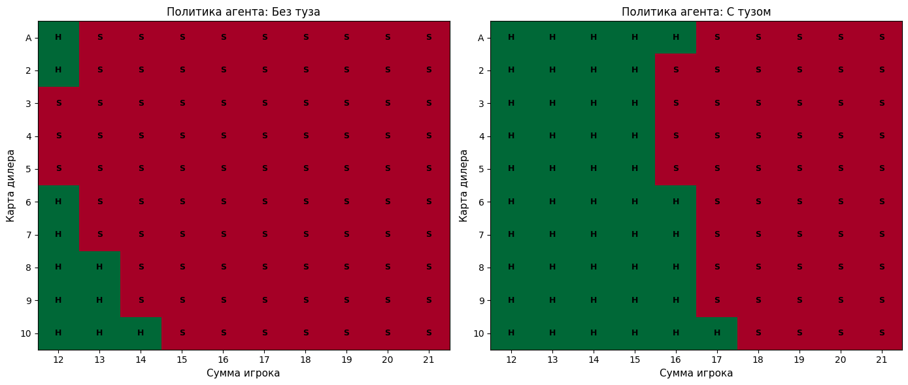

# actor-critic-blackjack

Агент actor-critic для блэкджека в Gymnasium: policy gradient и value-функция написаны вручную.

[](https://colab.research.google.com/github/yoonzky/actor-critic-blackjack/blob/main/actor_critic_blackjack.ipynb)

## Задача

Разработать actor-critic для среды `Blackjack-v1`, поэкспериментировать с размером сети, гаммой и параметрами обучения, показать лог ста игр обученного агента и график value-функции. Готовые реализации policy gradient и value-функции использовать нельзя.

## Как устроено

- Среда векторизована: `gym.make_vec("Blackjack-v1", num_envs=32, vectorization_mode="sync", sab=True)` — шаг идёт сразу по 32 играм.
- Actor и critic — отдельные сети `Linear — ReLU — Linear — ReLU — Linear`; у актора на выходе softmax по двум действиям.
- Наблюдение нормируется: сумма игрока делится на 21, карта дилера на 10, туз идёт как 0 или 1.
- Серия экспериментов: маленькая сеть (32), большая сеть (256), низкая гамма (0,50), высокий learning rate (1e-3). Затем финальное обучение на 200 000 эпизодов.

## Результаты

Прогон в Colab на T4. За обучение: 35 720 побед, 45 495 поражений, 5947 ничьих.

Контрольная серия из 100 игр: **36 побед, 53 поражения, 11 ничьих**; действий Hit — 51 (35,7 %), Stick — 92 (64,3 %).

Value-функция начального состояния и средняя награда растут всё обучение и к 200 000 эпизодов ещё не вышли на плато:



Выученная политика осторожная: без туза агент берёт карту только на 12–14 очках, с тузом, когда перебор не грозит, — до 16–17.



## Запуск

```
pip install -r requirements.txt
jupyter notebook actor_critic_blackjack.ipynb
```

## Стек

Python, PyTorch, Gymnasium, NumPy, Matplotlib.

Учебный проект курса «Программные средства разработки систем искусственного интеллекта», СПбГЭТУ «ЛЭТИ», 2026.
